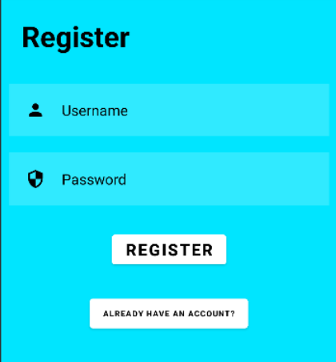
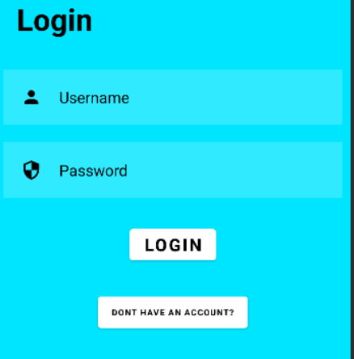
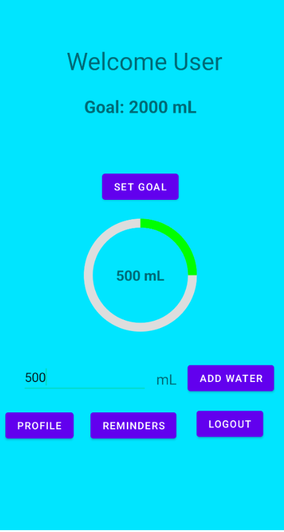
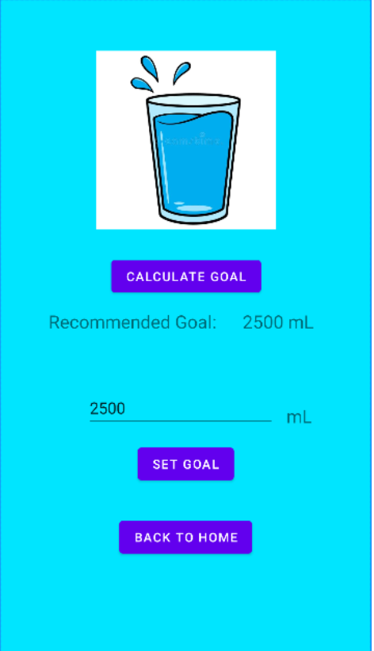
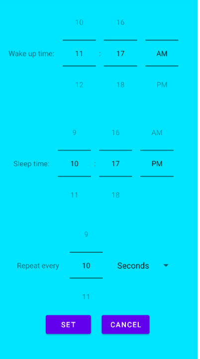
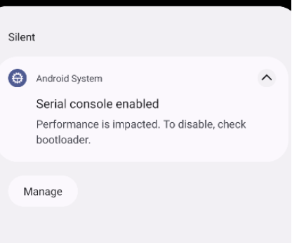
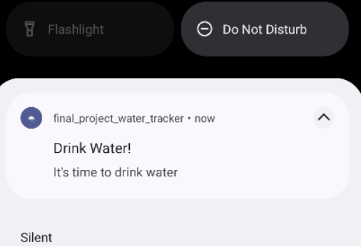
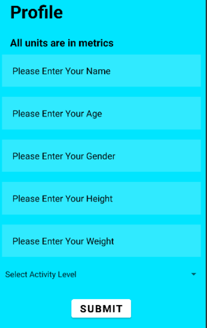
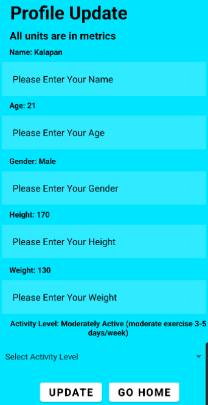

# Hydration Tracker Android App
---

<u>Table of contents</u>
=======

<!--ts-->
  - [Problem Statement](#problem-statement)
  - [Objectives](#objectives)
  - [App Architecture](#architecture)
  - [Development Tools](#devtools)
<!--te-->

---

## Problem Statement

Introducing the 'Hydration Tracker Android App,' a solution addressing the critical issue of inadequate water intake, particularly prevalent among older adults who often face diminished thirst sensations and medication-induced fluid loss. This mobile application promotes hydration awareness and habit formation by offering real-time tracking of daily water consumption, tailored reminders, and intuitive accessibility via smartphones, making it a user-friendly tool to combat dehydration and improve overall well-being.

## Objectives

This mobile application addresses the challenge of inadequate water intake by motivating users to drink enough water and monitor their daily consumption. The app calculates recommended water goals based on the Total Daily Energy Expenditure (TDEE) formula, allowing users to set personalized targets or use the app's recommendation. Timed notifications remind users to drink and log their water intake, and they can track their progress toward daily goals. The app also offers biometric data collection, notification customization, and visual progress tracking to support healthier hydration habits while respecting user privacy.

<!-- ## Analysis 

These are the key functional requirements for Hydration  Tracker App

| Req ID | Description | Primary Stakeholders | Category | Priority | Success Criteria |
|----------|----------|----------|----------|----------|----------|
| Row 1, Col 1 | Row 1, Col 2 | Row 1, Col 3 | Row 1, Col 4 | Row 1, Col 5 | Row 1, Col 6 |
| Row 2, Col 1 | Row 2, Col 2 | Row 2, Col 3 | Row 2, Col 4 | Row 2, Col 5 | Row 2, Col 6 |
| Row 3, Col 1 | Row 3, Col 2 | Row 3, Col 3 | Row 3, Col 4 | Row 3, Col 5 | Row 3, Col 6 |
| Row 4, Col 1 | Row 4, Col 2 | Row 4, Col 3 | Row 4, Col 4 | Row 4, Col 5 | Row 4, Col 6 |
| Row 5, Col 1 | Row 5, Col 2 | Row 5, Col 3 | Row 5, Col 4 | Row 5, Col 5 | Row 5, Col 6 |
| Row 6, Col 1 | Row 6, Col 2 | Row 6, Col 3 | Row 6, Col 4 | Row 6, Col 5 | Row 6, Col 6 |
| Row 7, Col 1 | Row 7, Col 2 | Row 7, Col 3 | Row 7, Col 4 | Row 7, Col 5 | Row 7, Col 6 |
| Row 8, Col 1 | Row 8, Col 2 | Row 8, Col 3 | Row 8, Col 4 | Row 8, Col 5 | Row 8, Col 6 |
| Row 9, Col 1 | Row 9, Col 2 | Row 9, Col 3 | Row 9, Col 4 | Row 9, Col 5 | Row 9, Col 6 |
| Row 10, Col 1 | Row 10, Col 2 | Row 10, Col 3 | Row 10, Col 4 | Row 10, Col 5 | Row 10, Col 6 |
| Row 11, Col 1 | Row 11, Col 2 | Row 11, Col 3 | Row 11, Col 4 | Row 11, Col 5 | Row 11, Col 6 |
| Row 12, Col 1 | Row 12, Col 2 | Row 12, Col 3 | Row 12, Col 4 | Row 12, Col 5 | Row 12, Col 6 | -->

## App Architecture

The app starts off with the registration page. From here the user can register for a new account or click “Already Have an Account” button to go to the login page. If a user creates a new account, the user is directed to a profile page which gathers all the users information. After this page the user is directed to the home page. If the user logs in, the user is directed to to the home page. From the home page the user can click the “Set Goal” button to go to an activity to set their goal. On this activity the user can click the “calculate goal” button to get the recommended amount which is calculated with the users data, or the user can manually enter their desired goal and click “set goal”. From there the user can go back to the home page. At the home page the user can enter the amount of water they have drank and click the “Add Water” button to update their progress. The user can also click the “Profile” button to go to the profile update screen which allows users to updates their personal data. From their they can go back to the home page and are able to click the “Reminders” button which takes them to an activity where they can set the time they are asleep and how often they want reminders. Finally users are able to logout of their account by clicking the “Logout” button.
 
The app consists of the following components:
- <u>Intents</u>: Used to switch and send data between activities.
- <u>Relative Layout</u>: Structure different views within the activitiy.
- <u>Scroll View</u>: Used to fit more content on activity. 
- <u>Edit Text</u>: Used to gather user inputted data. 
- <u>Text View</u>: Used to display data. 
- <u>Button</u>: Used to navigate and submit. 
- <u>Spinner</u>: Used to display data in an easy to use way.

## Development Tools 
Below, you'll find a list of tools and components used to enhance the application's user experience and functionality.
- __Java__ as the programming language of this project.
- __MongoDB__ as database usage and requirement for the application. We gathered users’ personalized information and stored it in __JSON__ format.
- Used Intent for connecting through the application and transferring from one activity to another and redirecting users between various sections of the app.
- Implemented save state mechanism for the obtained information while using the application.
- Implemented alarm manager and notification builder for notification settings. 
- Formatted the application by using Scroll layout and relative layout.
- Various widgets to display data.

## User Interface 

The primary focus of the User Interface design is centered on simplicity and ease of use, ensuring an intuitive experience for application users. The UI has been precisely designed by integrating multiple sample pages and providing clear guidance on utilizing various widgets. Upon launching the application, users are greeted with a registration page for their initial setup, where they are prompted to provide the necessary information for account creation. For returning users, a straightforward 'Sign In' option is available to access their existing accounts within the application.

  &nbsp;&nbsp;&nbsp;
  

 

The next page in the application is the home page of it. As we can see here it contains different information and widgets.
The first one is the Goal of intake water for the user. The user can also modify this goal amount by using the Set Goal option.
The next part is showing the total progression of water consumption for the user. Also, Add Water allows the user to add water drank by using this section. In the Add Water section, the user can input the amount of consumed water, so the total progress will be updated based on it in the Home Page.
The last three options are profile, reminders, and logout for adjusting user’s information, modify notifications, and log out from account respectively.

  

 

In the Set Goal page, users can set a custom amount of intake water goal or use the Calculate Goal to do the calculation based on Total Daily Energy Expenditure formula.
The goal amount will be updated as well in the home page. We can move back to the home page by using the Back to Home button.

  

 

In the Reminder page, we can set wake up and sleep time for the application, so the application won’t send any notifications to the user during sleeping time. We also have the option to set preferred time intervals to get notifications throughout the day.

  &nbsp;&nbsp;&nbsp;
  &nbsp;&nbsp;&nbsp;
  

 

The last section is the 'Profile,' where users can update their personal details. All user information is stored and retrieved using MongoDB for reuse.

  &nbsp;&nbsp;&nbsp;
  

